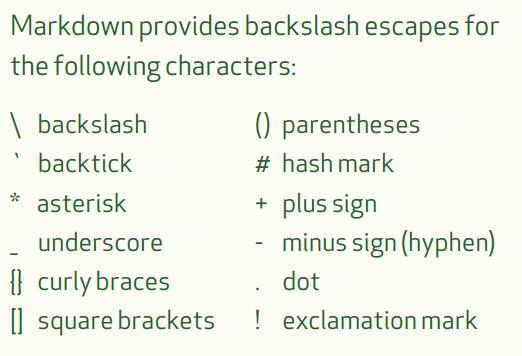

## markdown study
### [参考文档](markdown-cheatsheet-online.pdf)

# 一级标题
## 二级标题

#### 无序列表
- 1
- 2
* 3
    * 1
    * 2

#### 有序列表
1. 1
2. 2
    1. 1
    2. 2

#### 引用
> 我是引用

#### 我是链接
[百度](https://www.baidu.com)

#### 我是图片 


**我是粗体**
*我是斜体*
_我是斜体_
*斜**粗体**体*

#### 转义
\*我是转义内容\*



`print("Hello!");// 单行代码`

```javascript
   // 多行js代码
   console.log('hello1');
   console.log('hello2');
```
```html
   <!--多行html代码-->
   <h1>hello1</h1>
   <h1>hello2</h1>
```

#### 表格
<table>
<tr>
    <td>我是单元格</td>
</tr>
</table>

#### 我是分割线
***

&copy; heiliuer 2016

:+1:
:sparkles:
